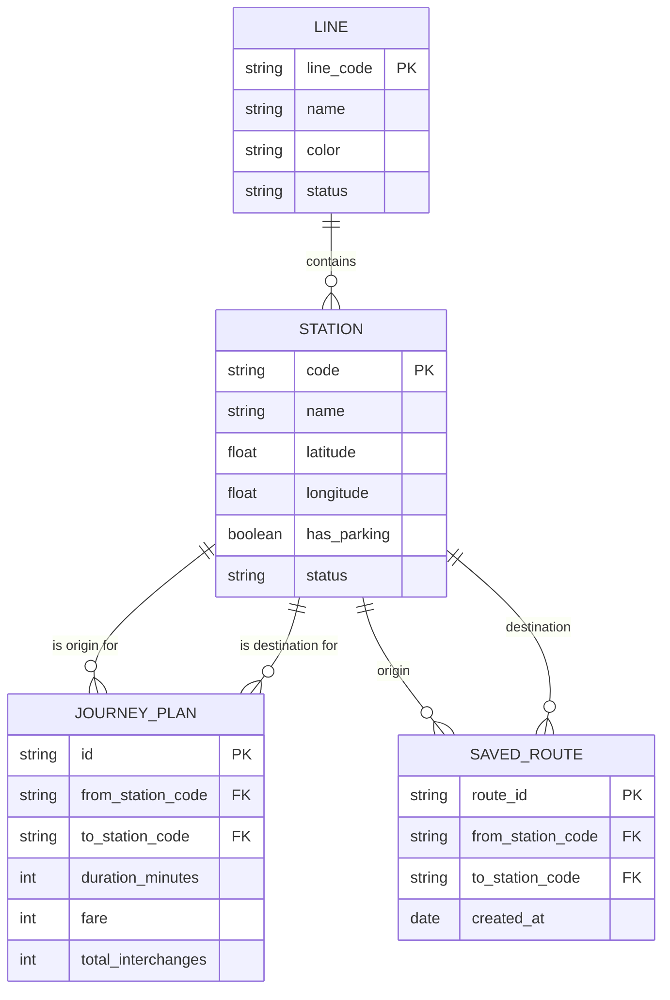
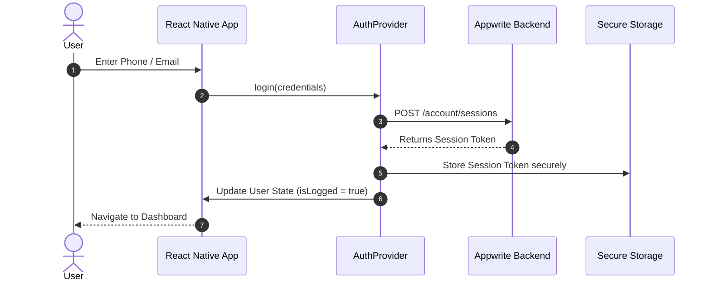

# 🗄️ Data Models & Flows

<div align="center">
  
</div>
<br>

This document maps out the entity relationships and data flow within the application, particularly highlighting local cache schemas and API responses.

## Entity Relationship Diagram (ERD)

This diagram visualizes how the stations, lines, and journey records relate to each other within our caching and API schema.



## Authentication Data Flow

A detailed sequence showing how user authentication is handled via Appwrite, including secure session storage.



## Theming Data Structure

Our bento-box UI heavily depends on structured theming JSON. Here's a brief JSON schema representation:

<details>
<summary><b>View Theme JSON Structure</b></summary>
<br>

```json
{
  "colors": {
    "primary": "#6750A4",
    "onPrimary": "#FFFFFF",
    "primaryContainer": "#EADDFF",
    "background": "#FFFBFE",
    "surface": "#FFFBFE"
  },
  "metrics": {
    "bentoRadius": {
      "button": 12,
      "card": 24,
      "pill": 999
    },
    "spacing": {
      "sm": 8,
      "md": 16,
      "lg": 24
    }
  }
}
```
</details>

> 💡 **Tip:** To modify the theme globally, update the constants in `src/theme/colors.ts` and `src/theme/spacing.ts`.
