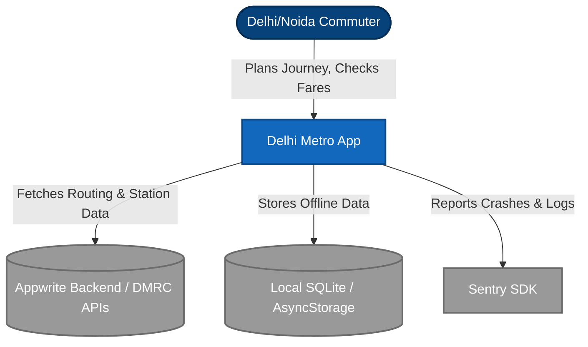
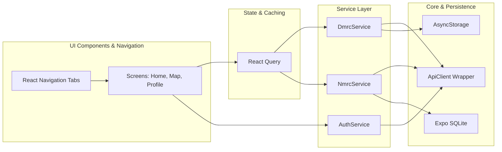
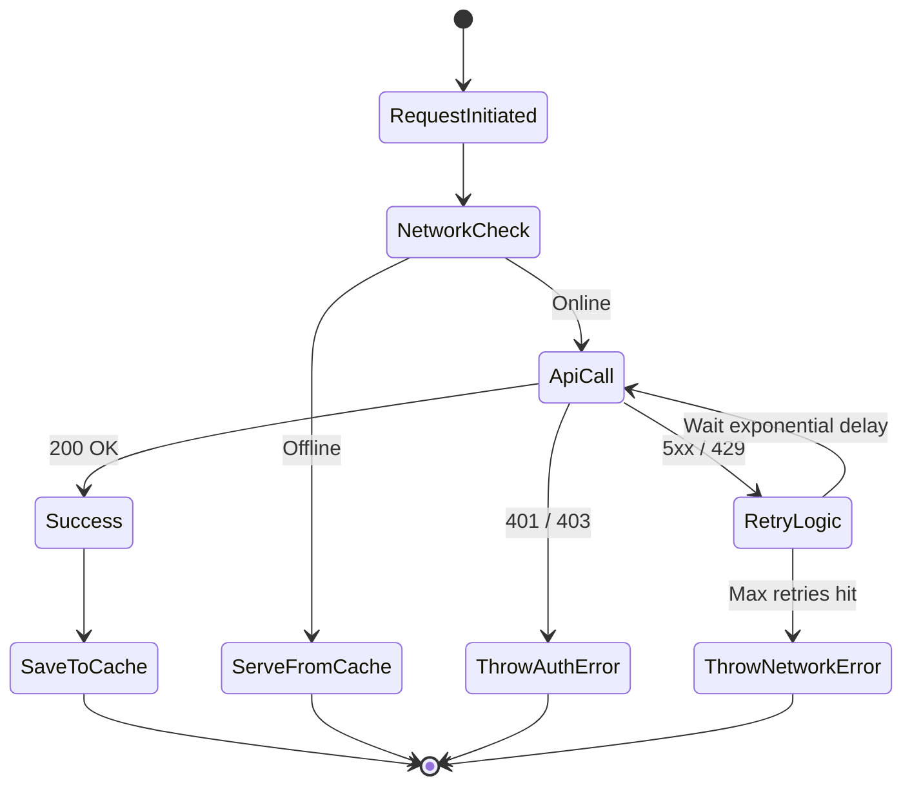

# 🏗️ System Architecture & Design

  
  

 

This document outlines the deeper system design for the Delhi Metro Clean application using rich diagrams.

## C4 Context Diagram

The context diagram shows how the app interacts with external entities and users.

## Application Component Diagram

A look inside the React Native application boundaries.

> **Note on Service injection**: All services are instantiated and managed via our custom Dependency Injection (DI) provider at the root level, making them highly testable.

## Error Handling & Resiliency Flow

